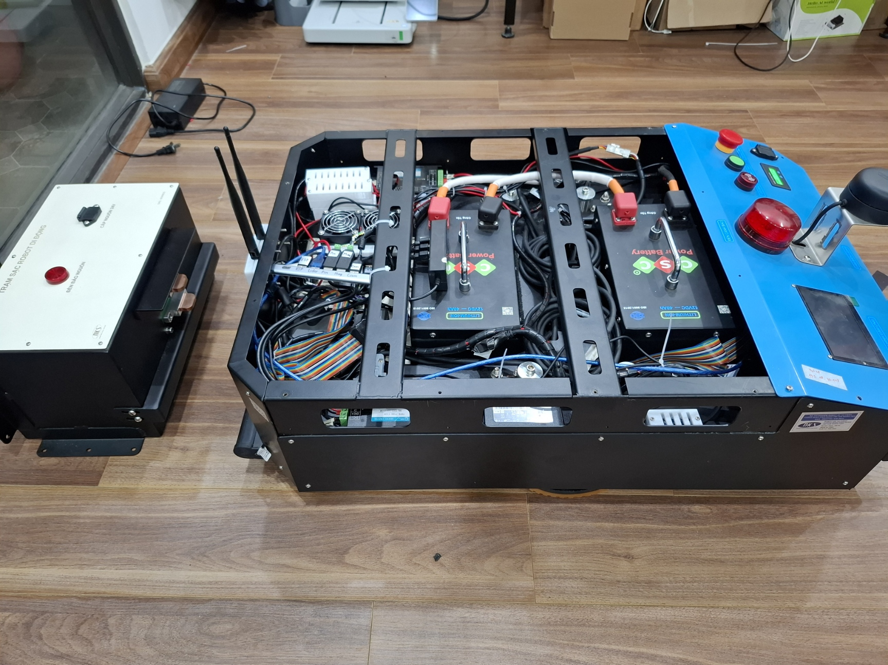
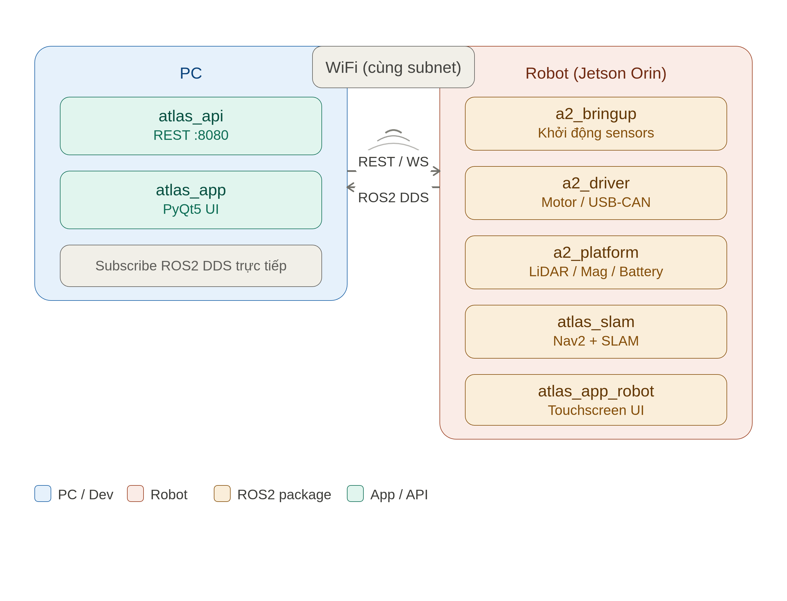

# Atlas A2 — Autonomous Mobile Robot

<p align="center">
  
</p>

Robot tự hành trong nhà chạy **ROS2 Humble** trên **Jetson Orin Nano**, tích hợp SLAM, Nav2, tự về trạm sạc bằng line-follow từ trường, điều khiển qua app PyQt5 và REST API.

---

## Chức năng chính của Robot

- **Tự định vị & dẫn đường (SLAM + Nav2)** — xây bản đồ bằng `slam_toolbox`, định vị bằng AMCL, lập đường đi bằng Nav2 (DWB / MPPI controller)
- **Chạy theo waypoints** — lưu danh sách vị trí, chạy route tuần tự hoặc lặp vòng, hỗ trợ route type `confirm` (chờ xác nhận tại mỗi điểm)
- **Tự về trạm sạc** — khi pin thấp, robot tự navigate đến gần trạm rồi bám vạch từ trường (16 kênh analog) để docking chính xác. Tự undock khi có lệnh mới
- **Phát hiện va chạm & E-Stop** — cảm biến va chạm ESP32 + nút dừng khẩn cấp phần cứng
- **Camera + YOLO** — stream video qua API, hỗ trợ nhận diện vật thể realtime
- **Tường ảo & vùng đặc biệt** — vẽ trực tiếp trên bản đồ để giới hạn khu vực robot đi qua
- **Bánh mecanum** — di chuyển đa hướng, xoay tại chỗ

---

## Giao diện App

<p align="center">
  
</p>

App điều khiển PyQt5 chạy trên PC, kết nối robot qua ROS2 DDS + REST API:

- **Bản đồ realtime** — hiển thị map, laser scan, robot pose, đường đi (plan), costmap local/global
- **Điều hướng trực quan** — click đặt Nav Goal, Set Pose, đo khoảng cách trực tiếp trên bản đồ
- **Quản lý waypoints** — lưu / xóa / sửa tên vị trí, kéo thả sắp xếp route
- **Tường ảo & vùng đặc biệt** — vẽ tường ảo, đánh dấu vùng cấm / vùng chậm trên bản đồ
- **Build mode** — điều khiển tay bằng bàn phím trong khi xây bản đồ SLAM
- **Quản lý bản đồ** — lưu / load / xóa bản đồ, khởi động SLAM hoặc navigation từ app
- **Giám sát trạng thái** — battery, E-Stop, Laser, IMU, cảm biến từ, docked, tốc độ, tọa độ
- **Auto-charge** — tự gửi lệnh về sạc khi pin dưới ngưỡng cài đặt
- **Video stream** — xem camera từ robot realtime
- **Log hệ thống** — theo dõi mọi sự kiện trong app

App cảm ứng trên robot (`atlas_app_robot`) hiển thị danh sách waypoints dạng nút lớn, theo dõi route, nút xác nhận — tối ưu cho màn hình touchscreen.

---

## Phần cứng

<p align="center">
  
  &nbsp;
  
</p>

| Thành phần | Model | Kết nối |
|---|---|---|
| Main computer | Jetson Orin Nano Developer Kit (Super) | — |
| Motor driver | TSDA-C12D | USB-CAN (`/dev/usbcan`) |
| Motor | TODE brushless | CAN bus |
| Bánh xe | Supo mecanum | — |
| LiDAR | RPlidar A2M12 | USB (`/dev/rplidar`) |
| Cảm biến từ trường | 16-kênh analog (Modbus RTU) | USB (`/dev/magnetic`) |
| Cảm biến va chạm | ESP32 | USB (`/dev/esp32`) |
| Pin (BMS) | — | USB (`/dev/battery`, Modbus RTU) |
| Camera | USB UVC (v4l2) | `/dev/video0` |

> **USB Hub**: Dùng hub **có nguồn riêng (powered)** để tránh lỗi ETIMEDOUT khi boot đồng thời nhiều thiết bị.

---

## Kiến trúc hệ thống

<p align="center">
  
</p>

> **ROS_DOMAIN_ID** phải giống nhau trên cả PC và robot.
> AP client isolation phải **tắt** để DDS hoạt động cross-machine.

---

## Cài đặt nhanh

### 1. Clone và build

```bash
git clone <repo-url> ~/atlas_a2
cd ~/atlas_a2
colcon build
source install/setup.bash
```

### 2. Cài autorun trên robot (Jetson)

```bash
sudo bash setup/install.sh
```

Script sẽ hỏi chọn chế độ:

| Lựa chọn | Mô tả |
|-----------|-------|
| **1** | Chỉ Bringup — systemd service, tự chạy khi boot |
| **2** | Chỉ App Robot — desktop autostart + shortcut |
| **3** | Cả hai — Bringup + App Robot |

### 3. Cấu hình IP cho app cảm ứng

Sửa dòng `API_HOST` trong `setup/start_app_robot.sh`:

```bash
API_HOST="192.168.x.xxx:8080"   # IP của PC đang chạy atlas_api
```

### 4. Chạy thủ công

**Trên robot:**
```bash
bash setup/start_bringup.sh       # sensors + driver + nav2
bash setup/start_app_robot.sh     # app cảm ứng
```

**Trên PC:**
```bash
ros2 launch atlas_api atlas_api_real.launch.py   # API server + ROS2 bridge
ros2 launch atlas_app atlas_app.launch.py        # ứng dụng điều khiển
```

---

## Cấu trúc thư mục

```
atlas_a2/
├── src/
│   ├── a2_bringup/          Launch files tổng hợp + line_follow + YOLO
│   ├── a2_driver/           Driver motor qua USB-CAN (TSDA-C12D)
│   ├── a2_platform/         Cảm biến phần cứng: lidar, pin, va chạm, từ trường
│   ├── atlas_base/
│   │   ├── atlas_api/       REST + WebSocket API server (Flask, chạy trên PC)
│   │   ├── atlas_app/       Ứng dụng điều khiển PyQt5 (PC, operator)
│   │   ├── atlas_app_robot/ Ứng dụng cảm ứng PyQt5 (robot, Jetson)
│   │   ├── atlas_slam/      Launch + config cho SLAM toolbox, Nav2, AMCL
│   │   ├── atlas_maps/      Bản đồ đã lưu (.yaml + .pgm)
│   │   └── atlas_web/       Web dashboard (port 8888)
│   ├── rf2o_laser_odometry/ Laser odometry từ LiDAR scan
│   ├── rplidar_ros/         Driver RPlidar A2M12
│   └── yolov8_msgs/         Message types cho YOLO object detection
└── setup/
    ├── install.sh           Cài đặt autorun (3 chế độ lựa chọn)
    ├── start_bringup.sh     Khởi động bringup (robot)
    ├── start_app_robot.sh   Khởi động app cảm ứng (robot) — chỉnh API_HOST tại đây
    └── HUONG_DAN.md         Hướng dẫn cài đặt chi tiết
```

---

## REST API

Base URL: `http://<PC_IP>:8080`

| Endpoint | Method | Chức năng |
|---|---|---|
| `/atlas/status` | GET | Trạng thái tổng hợp (nav, battery, docked...) |
| `/atlas/nav/goal` | POST | Gửi nav goal `{x, y, yaw}` |
| `/atlas/nav/cancel` | POST | Huỷ nav |
| `/atlas/nav/dock` | POST | Bắt đầu line-follow docking |
| `/atlas/nav/dock_stop` | POST | Dừng docking |
| `/atlas/nav/charge` | POST | Chuỗi đầy đủ: nav → dock |
| `/atlas/waypoints` | GET/POST | Danh sách waypoints |
| `/atlas/launch/status` | GET | Trạng thái các node ROS2 |

WebSocket: `ws://<PC_IP>:8081` — broadcast status 5Hz.

---

## Hệ thống tự về trạm sạc (Docking)

```
atlas_api nhận lệnh dock
    │
    ▼
Spawn subprocess: line_follow.py
    │
    ├─ INIT → tìm vạch từ
    ├─ SEARCH → quét ±45° nếu không thấy vạch ngay
    ├─ FOLLOW → bám vạch từ về trạm sạc
    └─ STOPPED → hết vạch = ở trạm sạc
         │
         ├─ 5s publish zero velocity
         └─ exit(0) ── atlas_api_node phát hiện ──► /atlas/docked = true
```

**Undock tự động:** Khi có nav goal mới mà robot đang ở trạm sạc → dừng docking → tiến thẳng 30 cm ra khỏi trạm → gửi nav goal bình thường.

---

## Topics ROS2 chính

| Topic | Type | Nguồn |
|---|---|---|
| `/scan` | `LaserScan` | rplidar_node |
| `/atlas/scan_filtered` | `LaserScan` | relay từ `/scan` |
| `/atlas/odom` | `Odometry` | driver_node / rf2o |
| `/atlas/battery` | `BatteryState` | battery_node |
| `/atlas/emergency_stop` | `Bool` | collision_detect |
| `/atlas/imu` | `Imu` | driver_node |
| `/atlas/docked` | `Bool` | atlas_api_node |
| `/sensor/analog16` | `UInt16MultiArray` | mag_sensor_node |
| `/cmd_vel` | `Twist` | atlas_api / atlas_app |
| `/cmd_vel_mag` | `Twist` | line_follow (twist_mux) |
| `/map` | `OccupancyGrid` | slam_toolbox / map_server |
| `/plan` | `Path` | nav2 planner |

---

## Khắc phục sự cố

| Triệu chứng | Nguyên nhân | Giải pháp |
|---|---|---|
| rplidar không có `/scan` khi boot | USB chưa ổn định khi systemd start | `ExecStartPre=/bin/sleep 15` trong service (đã có) |
| Thiết bị USB timeout (ETIMEDOUT -110) | USB hub không có nguồn riêng | Dùng powered USB hub |
| App robot không kết nối được API | `API_HOST` sai | Sửa `setup/start_app_robot.sh` |
| DDS không thấy topic cross-machine | AP client isolation | Tắt trên router, kiểm tra `ROS_DOMAIN_ID` |
| line_follow không bám vạch | `SENSOR_GATE` / `THRESHOLD_SUM` sai | Điều chỉnh param trong `line_follow.py` |
| Nav2 không nhận goal | `atlas_api` chưa chạy hoặc nav2 chưa sẵn sàng | Kiểm tra `ros2 topic list`, `/navigate_to_pose` action |

---

## Phần mềm yêu cầu

| Yêu cầu | Version |
|---|---|
| Ubuntu | 22.04 LTS |
| ROS2 | Humble |
| Python | 3.10+ |
| PyQt5 | ≥ 5.15 |
| Flask | ≥ 3.0 |
| Nav2 | humble |
| slam_toolbox | humble |

---

## Liên hệ

roboticsvn.ai@gmail.com
